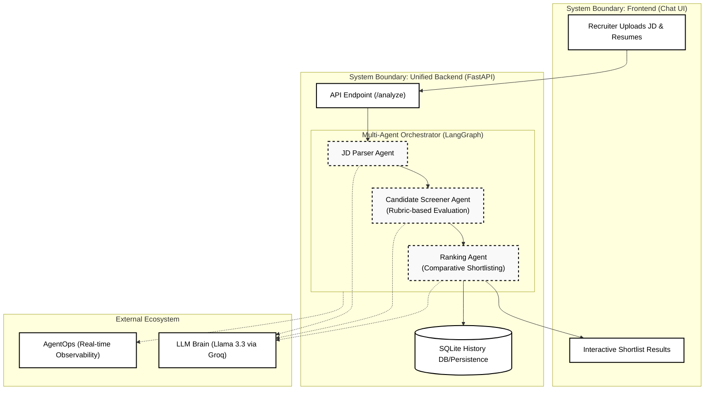

# Project Architecture: RecruitFlow AI

This document provides a visual and technical overview of the multi-agent orchestration within RecruitFlow AI.

## 📊 System Architecture Diagram

## 🛠️ Tech Stack Overview
- **Orchestration**: LangGraph (Stateful Multi-Agent Workflows)
- **Backend API**: FastAPI (Python)
- **Frontend**: Vanilla Javascript + Tailwind CSS
- **Database**: SQLite (Local persistence)
- **Observability**: AgentOps (End-to-end tracing)
- **Deployment**: Render (Unified Docker Container)

---

> [!TIP]
> **AgentOps Integration**: Every node execution seen in the diagram above is tracked as a distinct event in your AgentOps explorer, allowing for full "Chain of Thought" auditing.
